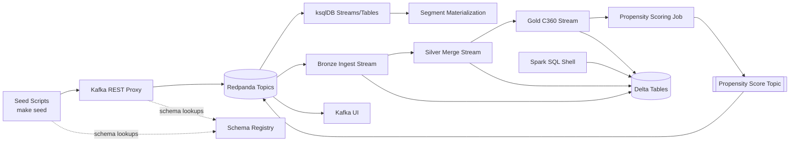

# Marketing Engine Demo

Local sandbox to showcase a marketing event pipeline: REST-based seed scripts publish Avro payloads to Redpanda, ksqlDB enriches the streams, and Spark Structured Streaming materialises Delta Lake gold tables plus a propensity-scoring topic.

## Architecture Overview



- Seed scripts hit the REST Proxy using Schema Registry for Avro payloads.
- ksqlDB builds the customer profile cache, order summary tables, and downstream segment topics.
- Spark jobs ingest the Kafka topics into Delta bronze/silver/gold layers and emit propensity scores.
- Kafka UI and Spark SQL offer visibility into the live event streams and Delta snapshots.

## Demo walkthrough

All setup commands, step-by-step narratives, and SQL snippets now live in [`DEMO.md`](DEMO.md). Use that guide to spin up the stack (`make up`), explore the helper UI on port 5000, seed example data, and run the consolidated ksqlDB query that surfaces customer names and order metrics.

The web UI keeps a Redis-backed cache of the consolidated customer view so refreshes stay instant. Point `REDIS_URL` at your shared Redis instance (default: `redis://host.docker.internal:6379/0` when running via Docker).

## Lifecycle Stage Calculation

The **lifecycle_stage** field tracks a customer's journey and is used throughout the pipeline for segmentation and analytics. Here's how it flows through the system:

### 1. Data Source (Initial Assignment)
When customers are created via the webapp or seed scripts, the lifecycle stage is randomly assigned from these values:
- `prospect` - Potential customer who hasn't made a purchase
- `customer` - Active customer with orders
- `evangelist` - Loyal customer with high engagement
- `churn-risk` - Customer at risk of leaving

Location: [webapp/app.py:634](webapp/app.py#L634)

### 2. ksqlDB Stream Processing
The lifecycle stage flows through several ksqlDB streams and tables:

**Stream 1: Customer Profile Source** ([ksql/streams.sql:15-26](ksql/streams.sql#L15-L26))
- Ingests from `dom.customer.profile.upsert.v1` Kafka topic
- Extracts `lifecycle_stage` field from Avro payload

**Table 1: Customer Profile** ([ksql/streams.sql:28-39](ksql/streams.sql#L28-L39))
- Maintains latest profile using `LATEST_BY_OFFSET()`
- Stores current lifecycle_stage for each customer

**Stream 2: Enriched Orders** ([ksql/streams.sql:67-82](ksql/streams.sql#L67-L82))
- Joins orders with customer profiles
- Enriches each order with customer's lifecycle_stage

**Table 2: Consolidated Customer** ([ksql/streams.sql:94-112](ksql/streams.sql#L94-L112))
- Aggregates order metrics by customer
- Includes lifecycle_stage in consolidated view

**Stream 3: Segment Materialization** ([ksql/streams.sql:140-157](ksql/streams.sql#L140-L157))
- Uses lifecycle_stage in CASE statements for advanced segmentation
- Example: High-value evangelists vs. at-risk customers

### 3. Spark Processing
The Spark jobs pass through the lifecycle_stage without modification:

**Gold Layer C360** ([spark/gold_c360.py:73](spark/gold_c360.py#L73))
- Selects lifecycle_stage from customers Delta table
- Includes in 360-degree customer view
- No transformation - preserves original value

### 4. Web Display
The Flask webapp displays lifecycle_stage in the consolidated customer table:

**Backend** ([webapp/app.py:187-194](webapp/app.py#L187-L194))
- Reads from Redis cache (populated by Kafka consumer)
- Normalizes field extraction from various sources

**Frontend** ([webapp/templates/index.html:134-148](webapp/templates/index.html#L134-L148))
- Displays in 4th column of customer table
- Shows current lifecycle stage for each customer

### Data Flow Summary
```
Seed/Webapp (Random Assignment)
    ↓
Kafka Topic: dom.customer.profile.upsert.v1
    ↓
ksqlDB: S_CUSTOMER_PROFILE_SOURCE (stream)
    ↓
ksqlDB: T_CUSTOMER_PROFILE (table - LATEST_BY_OFFSET)
    ↓
ksqlDB: S_CUSTOMER_ORDER_ENRICHED (stream - joined with orders)
    ↓
ksqlDB: T_CUSTOMER_CONSOLIDATED (table - aggregated)
    ↓
Kafka Topic: dom.customer.consolidated.v1
    ↓
Redis Cache (via Kafka consumer thread)
    ↓
Flask Webapp (display in UI)
```

**Note**: The lifecycle_stage is currently set randomly at creation time and flows through the pipeline unchanged. In a production system, this would be dynamically calculated based on customer behavior, purchase patterns, engagement metrics, and predictive models.
