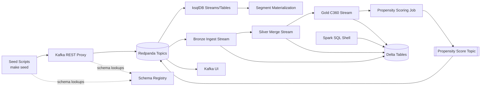

# Marketing Engine Demo

Local sandbox to showcase a marketing event pipeline: REST-based seed scripts publish Avro payloads to Redpanda, ksqlDB enriches the streams, and Spark Structured Streaming materialises Delta Lake gold tables plus a propensity-scoring topic.

## Architecture Overview

- Seed scripts hit the REST Proxy using Schema Registry for Avro payloads.
- ksqlDB builds the customer profile cache, order summary tables, and downstream segment topics.
- Spark jobs ingest the Kafka topics into Delta bronze/silver/gold layers and emit propensity scores.
- Kafka UI and Spark SQL offer visibility into the live event streams and Delta snapshots.

## Demo walkthrough

All setup commands, step-by-step narratives, and SQL snippets now live in [`DEMO.md`](DEMO.md). Use that guide to spin up the stack (`make up`), explore the helper UI on port 5000, seed example data, and run the consolidated ksqlDB query that surfaces customer names and order metrics.

The web UI keeps a Redis-backed cache of the consolidated customer view so refreshes stay instant. Point `REDIS_URL` at your shared Redis instance (default: `redis://host.docker.internal:6379/0` when running via Docker).
