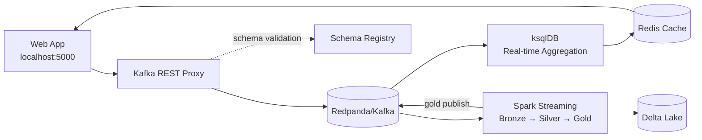

# Marketing Streams Demo

A real-time marketing data pipeline demonstrating event streaming, stream processing, and customer analytics using Kafka, ksqlDB, Spark, and Delta Lake.

## Overview

This project simulates a marketing platform where you can:
- Create customer profiles
- Add orders to track customer purchases
- Simulate marketing engagements (email, SMS, push notifications)
- View real-time aggregated customer metrics

## Architecture



### Data Flow

1. **Web App** - User creates customers, orders, and engagements
2. **Kafka Topics** - Events published to domain topics with Avro schemas
3. **ksqlDB** - Real-time stream processing and aggregation
4. **Spark** - Processes events through medallion architecture (bronze → silver → gold)
5. **Gold Layer Publishing** - Spark publishes enriched C360 data to Kafka
6. **Redis Cache** - Stores gold layer customer view for fast UI updates

## Quick Start

### Prerequisites

- Docker and Docker Compose
- Make

### Setup

```bash
# Start all services (Redpanda, ksqlDB, Schema Registry, Web App, Redis)
make up

# Open the web app
open http://localhost:5000
```

The web app provides three actions:
- **Create New Customer** - Creates a prospect with `is_active=false` and `lifetime_value=0`
- **Add Order** - Generates a random order for a customer (updates metrics)
- **Engage** - Simulates marketing engagement (email, SMS, push, in-app)

For custom deployments, export a `FLASK_SECRET_KEY` so session-based status banners persist across restarts:

```bash
export FLASK_SECRET_KEY="$(openssl rand -hex 32)"
```

### Run Spark Jobs

**Important**: Spark jobs are required for the webapp to function properly as it consumes from the gold layer.

```bash
make spark
```

This starts Spark Structured Streaming jobs that:
- Ingest events into Delta Lake (bronze layer)
- Transform and merge data (silver layer)
- Create customer 360 views with engagement metrics (gold layer)
- Publish gold C360 data to `dom.customer.gold.v1` topic for webapp consumption
- Calculate propensity scores based on orders, LTV, and engagement success

Activation metrics spin up automatically once the silver `activations` table appears (after the first engagement event). The gold job keeps watching for the table, so you do not need to restart Spark when activations arrive later. The web app also updates its Redis cache immediately after publishing an engagement, so delivered/failed counters update right away while the streaming jobs reconcile the persisted view.

By default the web app preserves cached Redis data between restarts. If you need to clear the cache on launch, start the container with `RESET_CACHE_ON_START=1`.

## Architecture Details

### Kafka Topics

| Topic | Schema | Description |
|-------|--------|-------------|
| `dom.customer.profile.upsert.v1` | Avro | Customer profile updates |
| `dom.order.placed.v1` | Avro | Order events |
| `dom.activation.delivery.status.v1` | Avro | Marketing engagement events |
| `dom.customer.consolidated.v1` | JSON | Aggregated customer metrics (ksqlDB output) |
| `dom.customer.gold.v1` | JSON | Gold layer C360 from Spark (webapp data source) |
| `dom.propensity.score.v1` | JSON | Customer propensity scores |
| `dom.segment.materialized.v1` | Avro | Customer segments |

### ksqlDB Streams & Tables

The ksqlDB topology creates:
- Customer profile table with LATEST_BY_OFFSET aggregation
- Order summary aggregations (lifetime value, order count)
- Activation/engagement summary (delivered vs failed messages)
- Consolidated customer table joining all metrics
- Segment materialization based on business rules

### Spark Jobs

Located in `spark/`:
- `ingest_stream.py` - Bronze layer: Raw event ingestion from Kafka to Delta
- `silver_customers_orders.py` - Silver layer: Curated data with UPSERT operations
- `gold_c360.py` - Gold layer: Customer 360 view with order and engagement metrics
- `publish_c360.py` - Publishes gold C360 data to `dom.customer.gold.v1` for webapp
- `score_and_publish.py` - Calculates propensity scores and publishes to Kafka

### Web Application

Built with Flask, the web app:
- Displays real-time customer data from Redis cache (sourced from Spark gold layer)
- Publishes events to Kafka via REST Proxy (customer profiles, orders, engagements)
- Consumes gold C360 data from `dom.customer.gold.v1` topic
- Shows customer metrics: orders, lifetime value, engagement stats, lifecycle stage

## Available Commands

```bash
make up          # Start all services
make down        # Stop services (preserve data)
make clear       # Stop services and remove all data
make spark       # Run Spark streaming jobs
make ksql        # Reapply ksqlDB topology
make schemas     # Register Avro schemas
make topics      # Create Kafka topics
make webapp      # Run web app in Docker
make webapp-local # Run web app locally (requires Python deps)
```

## Accessing Services

| Service | URL | Description |
|---------|-----|-------------|
| Web App | http://localhost:5001 | Customer management UI |
| Kafka UI | http://localhost:8080 | Browse topics and messages |
| ksqlDB Server | http://localhost:8088 | ksqlDB REST API |
| Schema Registry | http://localhost:8081 | Avro schema registry |
| REST Proxy | http://localhost:8082 | Kafka REST API |

## Customer Lifecycle

New customers start as:
- **Lifecycle Stage**: `prospect`
- **Status**: `inactive`
- **Lifetime Value**: `$0.00`
- **Orders**: `0`

As customers place orders, their lifecycle stage automatically updates:

### Lifecycle Stage Rules

Lifecycle stages progress based on orders, lifetime value, and engagement success:

| Stage | Criteria | Description |
|-------|----------|-------------|
| **prospect** | 0 orders | New customer, hasn't made first purchase |
| **customer** | 1+ orders | Active customer with purchase history |
| **engaged** | 1+ orders AND engagement rate > 50% | Customer actively responding to marketing |
| **high-value** | LTV > $5000 AND engagement rate < 70% | High-spending customer with moderate engagement |
| **evangelist** | LTV > $5000 AND engagement rate ≥ 70% | Top-tier customer: high spending and highly engaged |

**Engagement Rate** = Successful activations / Total activations (email, SMS, push, in-app)

### Automatic Updates

**When you click "Add Order":**
1. Order is created and published to Kafka
2. Lifetime value increases
3. Order count increments
4. Customer becomes **active** (if previously inactive)
5. **Lifecycle stage recalculates** based on orders, LTV, and engagement history
6. Updated profile publishes to Kafka (if stage changed)
7. Changes flow through ksqlDB → Redis → Web UI

**When you click "Engage":**
1. Random engagement is created (75% success rate)
2. Engagement published to Kafka (email, SMS, push, or in-app)
3. Spark processes engagement → updates gold C360
4. Higher engagement success rate helps progression to **engaged** and **evangelist** stages

## Data Storage

### ksqlDB State
ksqlDB maintains in-memory state stores for tables and streams, backed by Kafka topics.

### Spark Delta Lake
When running `make spark`, data is stored in:
```
delta/
├── bronze/     # Raw events from Kafka
├── silver/     # Curated, deduplicated data
└── gold/       # Aggregated customer 360 views
```

### Redis Cache
The web app caches the gold layer customer view in Redis for instant page loads. The cache is kept in sync via a background Kafka consumer thread that reads from `dom.customer.gold.v1`.

## Troubleshooting

**Web app shows no customers?**
- Create your first customer using the "Create New Customer" button
- Check that ksqlDB is running: `docker compose ps`

**ksqlDB errors?**
- Reapply topology: `make ksql`
- Check ksqlDB logs: `docker compose logs ksqldb`

**Schema errors?**
- Re-register schemas: `make schemas`

**Fresh start needed?**
```bash
make clear    # Removes all data and stops services
make up       # Restart from clean slate
```

## Project Structure

```
.
├── ksql/               # ksqlDB stream definitions
├── schemas/            # Avro schema definitions
├── scripts/            # Setup scripts (topics, schemas, ksqlDB)
├── spark/              # Spark Structured Streaming jobs
├── webapp/             # Flask web application
│   ├── app.py         # Main application
│   └── templates/     # HTML templates
├── docker-compose.yml  # Service definitions
└── Makefile           # Build and run commands
```

## License

This is a demonstration project to get my head around delta lake, spark and kafka streams.
