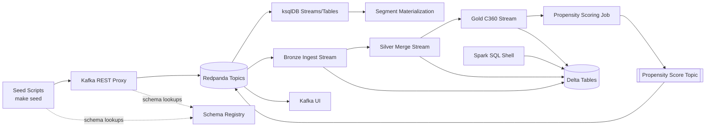

# Marketing Engine Demo

This repository provisions a local, end-to-end marketing streaming stack on top of Redpanda, Confluent Schema Registry + REST Proxy, ksqlDB, Kafka UI, and local Spark Structured Streaming pipelines that materialize bronze/silver/gold Delta tables and publish a propensity score topic.

## Architecture Overview



## Prerequisites

- Docker & Docker Compose plugin
- Optional: Python 3.11.9 if you prefer to run the Spark jobs on your host instead of the provided container. When building Python yourself (e.g., via pyenv) ensure `_lzma` support is enabled:
  ```bash
  brew install xz
  env LDFLAGS="-L/opt/homebrew/opt/xz/lib" \
      CPPFLAGS="-I/opt/homebrew/opt/xz/include" \
      PKG_CONFIG_PATH="/opt/homebrew/opt/xz/lib/pkgconfig" \
      pyenv install 3.11.9
  python3.11 - <<'PY'
import lzma
PY
  ```

## Quickstart

1. **Start the platform services**

   ```bash
   make up
   ```

   This launches Redpanda, Schema Registry, REST Proxy, ksqlDB, ksqlDB CLI container, and Kafka UI.

2. **Register Avro schemas**

   ```bash
   make schemas
   ```

   The script posts each `.avsc` under `schemas/` to the Schema Registry. It is safe to rerun at any time.

3. **Seed demo data**

   ```bash
   make seed
   ```

   Customer profiles, order events, and activation statuses are produced via the REST Proxy using the registered Avro schemas.

4. **Deploy the ksqlDB topology**

   ```bash
   make ksql
   ```

   The CLI pipes `ksql/streams.sql` into the ksqlDB server, creating the base streams, tables, and segment materialization stream.

5. **Run the Spark streaming jobs (containerized)**

   ```bash
   make spark
   ```

   The first run builds a lightweight image (Python 3.11.9 + Temurin JRE 17 + project requirements) and starts the service defined in `docker-compose.yml`. Logs stream in the foreground; press `Ctrl+C` to stop the jobs.

   This launches the four pipelines found in `spark/`:

   - `ingest_stream.py`: consumes Kafka topics and writes Delta bronze tables.
   - `silver_customers_orders.py`: builds curated silver tables with Delta MERGEs.
   - `gold_c360.py`: aggregates a customer 360º gold view.
   - `score_and_publish.py`: computes propensity scores from gold and publishes `dom.propensity.score.v1` to Kafka.

   Each stream maintains checkpoints beneath `/tmp/delta/` and writes Delta tables under `./delta/`.

6. **Explore the data**

   - Browse topics and schemas at [Kafka UI](http://localhost:8080/).
   - Inspect ksqlDB streams/tables at [ksqlDB REST API](http://localhost:8088/).
   - Query Delta tables using the Spark container:

     ```bash
     docker compose run --rm --entrypoint bash spark -lc "spark-sql -e 'SELECT * FROM delta.`/workspace/delta/gold/c360`'"
     ```

7. **Shutdown**

   ```bash
   make down
   ```

   This stops all containers and removes volumes.

## Directory Structure

- `docker-compose.yml` – Service topology for the marketing engine stack.
- `schemas/` – Avro schema definitions for customer, order, activation, and segment topics.
- `scripts/` – Bash helpers for schema registration and data seeding via REST Proxy.
- `ksql/streams.sql` – ksqlDB statements for ingest, enrichment, and segment materialization.
- `spark/` – Structured Streaming jobs, requirements, and orchestration script.
- `delta/` – Local Delta Lake storage (created at runtime).
- `.checkpoints/` – Streaming checkpoints (created when the Spark container runs).

## Optional: Run Spark jobs on the host

If you prefer to execute the Spark pipelines outside of Docker, prepare a matching environment:

```bash
python3.11.9 -m venv .venv
source .venv/bin/activate
pip install -r spark/requirements.txt
export JAVA_HOME=$(/usr/libexec/java_home -v 17)
export SPARK_CHECKPOINT_ROOT=$(pwd)/.checkpoints
bash spark/run_all.sh
```

Make sure `java` is available and the `lzma` module loads (`python -c "import lzma"`).

## Environment Variables

The following environment variables can override defaults when running scripts locally:

- `SCHEMA_REGISTRY_URL` – Base URL for Schema Registry (default `http://localhost:8081`).
- `REST_PROXY_URL` – Base URL for Kafka REST Proxy (default `http://localhost:8082`).
- `KAFKA_BOOTSTRAP_SERVERS` – Kafka bootstrap servers for Spark (default `localhost:9092`).
- `CUSTOMER_TOPIC`, `ORDER_TOPIC`, `ACTIVATION_TOPIC`, `PROPENSITY_TOPIC` – Topic overrides for ingestion and publishing.
- `SPARK_CHECKPOINT_ROOT` – Root directory for Spark checkpoints (default `/tmp/delta/checkpoints`).

## Notes

- Seed scripts are idempotent; rerunning them simply re-emits the same deterministic records keyed by business IDs.
- Delta checkpoints live under `/tmp/delta/*` to keep state separate from the repository.
- No external cloud dependencies are required; everything runs locally via Docker and Spark.
